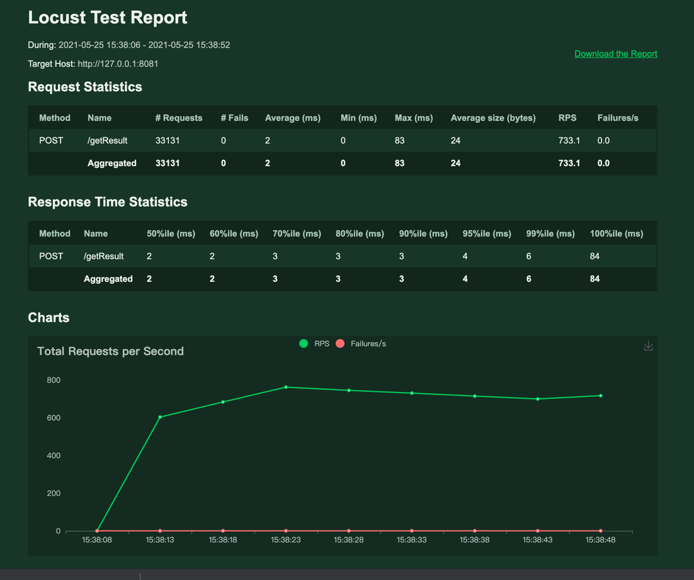

# go-project
go语言项目

# 接口文档

## 1）输入稀有度，当前解锁阶段和cvc，获取该稀有度cvc合法且已解锁的所有士兵
GET http://localhost:8000/getResult
Accept: application/json
```json
{"str":"3+2*2+13"}
```

```json
{
  "msg": "ok",
  "result": 20
}
```


## locust 压测数据

```sh
locust --host=http://127.0.0.1:8081 -f demoTest.py --logfile=locustfile.log
```

```python
from locust import HttpUser,task,between
class Test(HttpUser):
    @task
    def getResult(self):
        response =  self.client.post("/getResult",json={"str": "3+2*2+13"})
        print("response",response.status_code)

```

访问网址 http://127.0.0.1:8089



