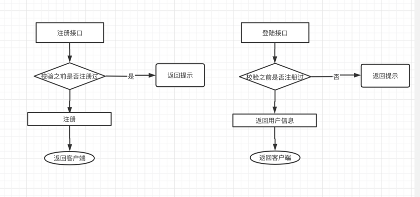
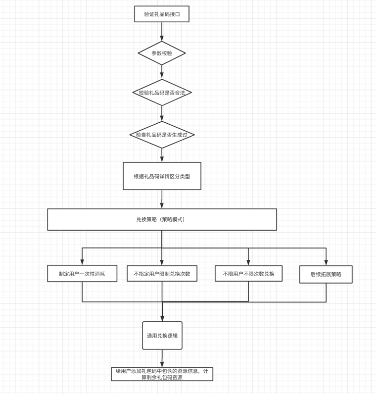

# go-project
go语言项目
## 目录结构
```text

.
├── README.md 
├── app.ini      (配置文件)
├── config       (配置映射struct)   
├── controller   (接入层)   
├── global       (单例全局对象)  
├── go.mod
├── handler      (数据库处理)  
├── initialize   (单例初始化)  
├── log
├── main.go      (入口)
├── model        (模型)
├── proto        (proto)
├── service      (业务处理)
├── test         (单元测试)
└── utils        (工具)

```
## 设计方案
### 创建礼品码/获取礼品码

### 登陆注册

### 验证礼品码

# 接口文档

## 1）创建礼包码
POST http://localhost:8000/cdkey/createCdkey

Accept: application/json

请求体
```json
{"cdkeyType":3,"cdkeyUser":"admin","createTime":"2021-05-26 15:00:00","creator":"admin","desc":"兑换吗","contents":[{"item":"金币","count":"10"},{"item":"钻石","count":"20"}],"expireTime":"2021-05-26 19:00:00","totalExchangeNum":3}
```
响应
```json
{"code":0,"data":"QEFI1VG8","msg":"ok"}
```

## 2）查询礼包码详情

GET http://localhost:8000/cdkey/getCdkeyDetails?cdkey=QEFI1VG8

Accept: application/json

响应
```json
{"code":0,"data":{"cdkeyType":3,"cdkeyUser":"admin","cdkey":"QEFI1VG8","createTime":"2021-05-26 15:00:00","creator":"admin","desc":"兑换吗","contents":[{"item":"金币","count":"10"},{"item":"钻石","count":"20"}],"expireTime":"2021-05-26 19:00:00","totalExchangeNum":3,"alreadyExchangeNum":0,"exchangeList":null},"msg":"ok"}
```


## ~~3）验证礼包码~~


~~GET http://localhost:8000/cdkey/verifyCdkey?cdkey=QEFI1VG8&user=admin~~

~~Accept: application/json~~

~~响应~~
```json
{"code":0,"data":{"cdkeyType":3,"cdkeyUser":"admin","cdkey":"QEFI1VG8","createTime":"2021-05-26 15:00:00","creator":"admin","desc":"兑换吗","contents":[{"item":"金币","count":"10"},{"item":"钻石","count":"20"}],"expireTime":"2021-05-26 19:00:00","totalExchangeNum":3,"alreadyExchangeNum":1,"exchangeList":[{"user":"admin","exchangeTime":"2021-05-26 20:59:36"}]},"msg":"ok"}
```

## 3）验证礼包码 proto协议

POST http://localhost:8000/cdkey/verifyCdkey?cdkey=VQ0DND3I&userId=431d6f79-9c8e-4f2e-84c5-431d3b315709

Accept: application/json

响应
```json
[18 2 111 107 26 4 8 1 16 10 26 4 8 2 16 20 34 4 8 2 16 100 34 4 8 1 16 50]
```

## 4）注册

GET http://localhost:8000/user/registerUser

Accept: application/json

响应
```json
{"code":0,"data":{"id":"ffd3c3e1-7b0d-413d-93a1-5a6c6976a651","contentMap":null},"msg":"操作成功"}
```


## 4）登陆

POST http://localhost:8000/user/login

Accept: application/json
请求
```json
{ "id":"08d4847c-42b7-46c5-b8b7-4333ad3cb410"}
```
响应
```json
{
  "code":0,
  "data":{
    "id":"08d4847c-42b7-46c5-b8b7-4333ad3cb410",//用户id
    "contentMap": {
      "1":10,//金币
      "2":20,//钻石
    }
  },
  "msg":"操作成功"
}
```

